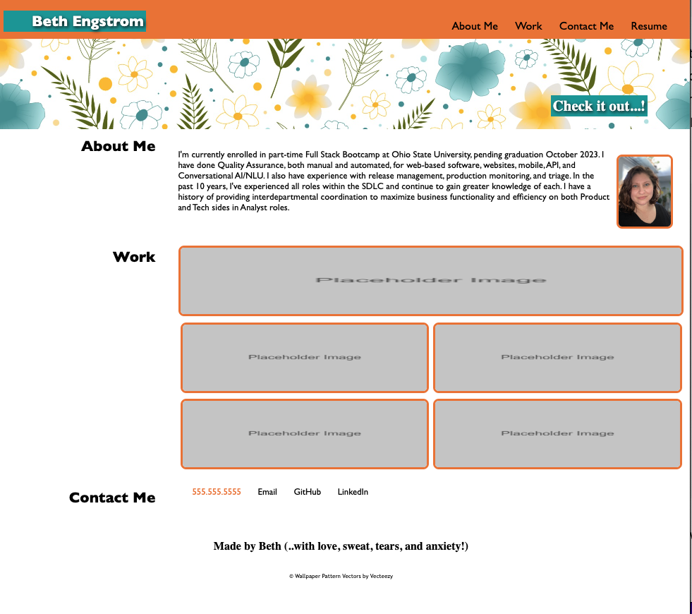

# README
## Description
Beth Engstrom HTML & CSS Portfolio Page

## Repository
https://github.com/betheng/engstrom-portfolio

## Deployment
- Go to gitHub > Site repo > Settings > Pages
- Then deploy to GitHub Pages

Live site link: https://betheng.github.io/engstrom-portfolio/
_____________________________
## Last Update

5/13/2023 (@betheng)- Deploy
### User Story
AS AN employer 
I WANT to view a potential employee's deployed portfolio of work samples 
SO THAT I can review samples of their work and assess whether they're a good candidate for an open position 

### ACs
GIVEN I need to sample a potential employee's previous work 
WHEN I load their portfolio 
THEN I am presented with the developer's name, a recent photo or avatar, and links to sections about them, their work,  and how to contact them 
WHEN I click one of the links in the navigation 
THEN the UI scrolls to the corresponding section 
WHEN I click on the link to the section about their work 
THEN the UI scrolls to a section with titled images of the developer's applications 
WHEN I am presented with the developer's first application 
THEN that application's image should be larger in size than the others 
WHEN I click on the images of the applications 
THEN I am taken to that deployed application 
WHEN I resize the page or view the site on various screens and devices 
THEN I am presented with a responsive layout that adapts to my viewport

### Sources
-Class material 
-YouTube - The Net Ninja - HTML & CSS series 
-YouTube - Kevin Powell - Learn flex box the easy way 
-YouTube - Traversy Media - Flexbox Crash Course 2022 
-W3Schools HTML & CSS classes 
-Homework One review 